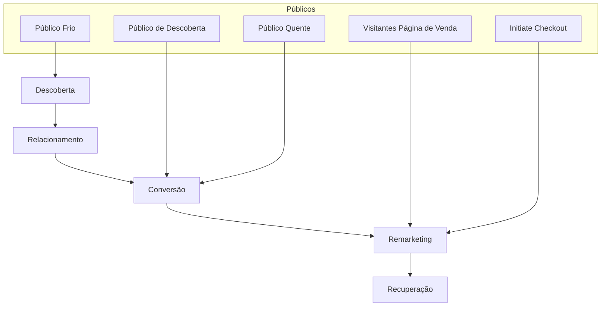

# Apostila: Combate de Longo Prazo - Google Ads Nível Intermediário

---

## Resumo

O nível intermediário em Google Ads caracteriza-se pela operação simultânea das fases de descoberta, conversão e remarketing, com investimento acumulado entre R$ 5.000 e R$ 10.000 e histórico de vendas já realizado. O funil de vendas é representado por um funil invertido com cinco fases: descoberta, relacionamento, conversão, remarketing e recuperação. A fase de descoberta tem como objetivo construir uma base de público qualificada, utilizando anúncios com gancho e conteúdo de valor, sem chamada para ação, exceto em casos específicos. A metrificação constante é essencial para avaliar a construção da audiência e o momento ideal para conversão.

---

## 1. Perfil do Profissional Intermediário em Google Ads

### 1.1 Definição

- Já realizou algumas vendas por meio de anúncios.
- Investimento acumulado entre R$ 5.000 e R$ 10.000.
- Opera campanhas nas fases de descoberta, conversão e remarketing.

### 1.2 Perfis Abrangidos

| Perfil               | Descrição                                                                                   |
|----------------------|---------------------------------------------------------------------------------------------|
| Profissionais Liberais| Pessoas em transição de carreira para o mercado de anúncios online, buscando competências técnicas sólidas. |
| Infoprodutores       | Produtores de conteúdo digital que desejam entender estratégias para colaborar melhor com gestores de tráfego. |
| Gestores de Tráfego  | Profissionais que operam campanhas e buscam aprimorar habilidades para aumentar resultados e rentabilidade. |

---

## 2. Estrutura do Funil Invertido no Marketing Digital

O funil invertido é segmentado em cinco fases sequenciais:

| Fase          | Função Principal                                      |
|---------------|------------------------------------------------------|
| Descoberta    | Apresentar a marca ao público e construir base de audiência. |
| Relacionamento| Nutrir o vínculo com a audiência conquistada.        |
| Conversão    | Transformar audiência em compradores.                  |
| Remarketing  | Reimpactar visitantes que não converteram.             |
| Recuperação  | Reconquistar clientes ou leads perdidos.               |

### 2.1 Diferença entre Iniciante e Intermediário

| Nível       | Fases Operadas                      | Característica Principal                          |
|-------------|-----------------------------------|--------------------------------------------------|
| Iniciante   | Conversão e Remarketing            | Opera somente as fases finais do funil.          |
| Intermediário| Descoberta, Conversão e Remarketing| Inclui a fase de descoberta, construindo base própria de público. |

---

## 3. Fase de Descoberta: Construção de Base de Público

### 3.1 Objetivo

- Construir uma base qualificada de audiência.
- Alcançar o maior número possível de pessoas com conteúdo relevante.
- Criar públicos personalizados a partir do consumo do conteúdo.

### 3.2 Funcionamento

- Veicular conteúdo de valor (exemplo: vídeo).
- Público que consome pelo menos 75% do conteúdo é armazenado em público personalizado.
- Essa "caixinha" de audiência será utilizada nas fases seguintes para conversão e remarketing.

---

## 4. Estrutura de Públicos por Fase do Funil

| Fase       | Tipo(s) de Público Utilizado(s)                                |
|------------|----------------------------------------------------------------|
| Descoberta | Público frio (audiência ampla e nova)                          |
| Conversão  | Público de descoberta (aquecido), públicos quentes e híbridos |
| Remarketing| Visitantes da página de venda e initiate checkout              |

- **Público Quente:** Já conhece a marca.
- **Público Frio:** Não conhece a marca.
- **Público Híbrido:** Mistura de características de público frio e quente.

---

## 5. Anatomia do Criativo na Fase de Descoberta

### 5.1 Elementos do Anúncio

| Elemento         | Descrição                                                                                      |
|------------------|------------------------------------------------------------------------------------------------|
| Criativo         | Peça visual ou audiovisual adequada à plataforma (ex: vídeo, imagem).                          |
| Gancho           | Elemento inicial que captura a atenção do público.                                            |
| Conteúdo de Valor | Material relevante que entrega benefício ao espectador, sem foco em venda direta.              |
| Chamada para Ação (CTA) | Ausente nesta fase para evitar pressão de compra imediata.                              |

### 5.2 Exceções para Inclusão de CTA

- **Anúncios para Seguidores:** Objetivo de aumentar base de seguidores nas redes sociais.
- **Anúncios para Iscas Digitais:** Objetivo de capturar leads por meio de materiais gratuitos (e-books, webinars, etc.).

---

## 6. Metrificação e Análise de Resultados

### 6.1 Importância

- Monitorar constantemente se a base de público está sendo construída.
- Avaliar o consumo do conteúdo e o crescimento do público personalizado.

### 6.2 Momentos de Conversão

- **Logo no início do aquecimento:** Quando o público demonstra alta propensão à compra.
- **Após período de nutrição:** Quando o relacionamento amadurece e a confiança é estabelecida.

---

## 7. Resumo Visual do Funil e Públicos

---

## 8. Pontos-Chave

- Perfil intermediário: já realizou vendas, investiu entre R$ 5.000 e R$ 10.000, opera as fases de descoberta, conversão e remarketing.
- Funil invertido com cinco fases: descoberta, relacionamento, conversão, remarketing e recuperação.
- Iniciante atua apenas em conversão e remarketing; intermediário inclui a fase de descoberta.
- Fase de descoberta foca em construir base de público com conteúdo de valor e sem CTA.
- Públicos personalizados são criados a partir do consumo de pelo menos 75% do conteúdo.
- Criativos de descoberta possuem gancho e conteúdo relevante, sem chamada para ação, exceto para seguidores e iscas digitais.
- Metrificação constante é essencial para identificar o momento ideal de conversão.
- Conversão pode ocorrer logo no início do aquecimento ou após período de nutrição.

---

## 9. Exemplos Práticos

- Criar uma campanha de descoberta com vídeos curtos que entreguem dicas ou informações úteis, sem pedir para comprar.
- Armazenar o público que assistiu 75% do vídeo em um público personalizado para usar em campanhas de conversão.
- Rodar campanhas de remarketing para visitantes da página de vendas e pessoas que iniciaram o checkout, aumentando a chance de finalização da compra.
- Em campanhas para seguidores, incluir CTA para seguir a página, diferente da regra geral da fase de descoberta.

---

## 10. Considerações Finais

O domínio do nível intermediário em Google Ads exige a capacidade de operar múltiplas fases do funil simultaneamente, com foco na construção ativa de uma base de público qualificada. A fase de descoberta é o diferencial que permite ao profissional não depender exclusivamente de audiências prontas, ampliando o alcance e a eficiência das campanhas. A análise constante dos dados e a adaptação das estratégias são fundamentais para o sucesso e a escalabilidade dos resultados.

---

# Fim da Apostila - Combate de Longo Prazo: Google Ads Nível Intermediário