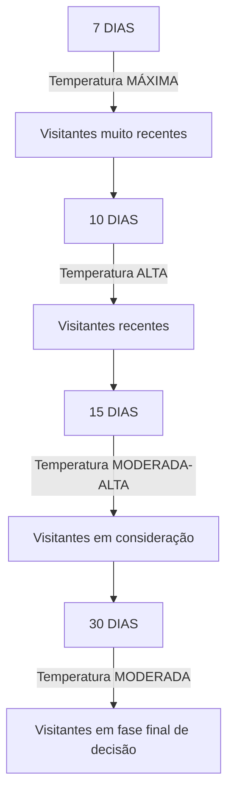

# Módulo 8: Combate de Longo Prazo - Perpétuo  
## Aula 46: Avançado Google - Campanha de Remarketing

---

## Resumo

Este módulo aborda a estratégia avançada de remarketing no Google Ads, focada em públicos super quentes, ou seja, usuários que já visitaram a página de vendas ou iniciaram o checkout. A metodologia utiliza múltiplas campanhas segmentadas por diferentes períodos de associação (7, 10, 15 e 30 dias), cada uma com um único criativo, para maximizar a capilaridade horizontal — impactar o mesmo público com diferentes ângulos e mensagens ao longo do tempo. O objetivo é aumentar a conversão direta, evitando saturação e otimizando o orçamento, que geralmente fica em torno de 5% do total de mídia. Inclui tutorial detalhado para criação e configuração dessas campanhas no Google Ads, além de recomendações para escalabilidade e ajustes conforme o orçamento disponível.

---

## 1. Introdução ao Remarketing Avançado

### 1.1 Contexto e Objetivo

- Remarketing avançado é a fase mais sofisticada da estratégia de reconquista de públicos qualificados no Google Ads.
- Substitui formatos antigos como Click Through View for Action e Discovery por campanhas do tipo Geração de Demanda.
- Foco em venda direta para usuários que já demonstraram interesse significativo, visitando a página de vendas ou iniciando o checkout.
- Público-alvo: super quente, pois já conhece a oferta em profundidade.

### 1.2 Premissa Central

- Usuários que já conhecem a oferta devem ser impactados com frequência controlada e variação de ângulos e criativos para manter o interesse e aumentar a conversão.
- A estratégia evita saturação e fadiga do público.

---

## 2. Estrutura da Campanha Avançada de Remarketing

### 2.1 Capilaridade Horizontal

- Multiplicação estratégica de campanhas para o mesmo público, cada uma com um criativo único.
- Permite atingir o usuário em diferentes momentos da jornada pós-visita com mensagens variadas.

### 2.2 Número de Campanhas e Criativos

| Aspecto                  | Nível Intermediário            | Nível Avançado                      |
|--------------------------|-------------------------------|-----------------------------------|
| Número de campanhas      | 1 campanha principal           | 3 ou mais campanhas                |
| Criativos por campanha   | 3 criativos                   | 1 criativo por campanha            |
| Períodos de associação   | 30 dias fixo                  | Variável: 7, 10, 15, 30 dias       |
| Estratégia              | Concentração                  | Capilaridade horizontal             |

### 2.3 Períodos de Associação e Temperatura do Público

| Período | Característica do Público       | Temperatura       |
|---------|--------------------------------|-------------------|
| 7 dias  | Visitantes muito recentes       | Máxima            |
| 10 dias | Visitantes recentes             | Alta              |
| 15 dias | Visitantes em consideração      | Moderada-Alta     |
| 30 dias | Visitantes em fase final decisão| Moderada          |

- Períodos maiores podem ser utilizados, mas a taxa de conversão tende a diminuir com o tempo devido à redução da conexão emocional.

---

## 3. Públicos-Alvo e Segmentação

- Públicos super quentes:
  - Visitantes da página de vendas (PV)
  - Usuários que iniciaram o checkout (Initiate Checkout - IC)
- Exclusão de clientes já convertidos para evitar desperdício de verba.
- Segmentação rigorosa garante investimento eficiente e alta probabilidade de conversão.

---

## 4. Orçamento e Alocação de Verba

- Recomenda-se alocar cerca de 5% do orçamento total de mídia para remarketing.
- Percentual inicial, não regra fixa.
- Ajustes devem considerar:
  - Tamanho do público: público muito pequeno pode causar fadiga por excesso de exposição.
  - Retorno sobre investimento (ROI): métricas positivas podem justificar aumento de verba.
  - Custo por aquisição (CPA): CPA elevado em relação ao ticket médio indica necessidade de revisão.

---

## 5. Checklist de Pré-Requisitos para Implementação

Antes de iniciar a campanha avançada, certifique-se de:

- [x] Conversão personalizada criada.
- [x] Pixel instalado na página de vendas.
- [x] Pixel instalado na plataforma de checkout (ex: Hotmart).
- [x] Hierarquia de públicos estruturada por períodos de associação.
- [x] Criativos desenvolvidos para cada campanha.
- [x] Copy alinhada com CTA forte de venda direta.
- [x] Link de destino ou página de aterrissagem com congruência comunicacional.

---

## 6. Tutorial Prático: Criação de Campanhas por Período no Google Ads

### 6.1 Campanha Base

- Partir da campanha de remarketing de 30 dias criada no nível intermediário.

### 6.2 Passos para Criar a Campanha de 7 Dias

1. Duplicar a campanha de 30 dias.
2. Renomear para padrão: incluir "7D" e "AVA" (ex: Remarketing AVA 7D).
3. Manter orçamento e configurações originais.
4. Acessar o conjunto de anúncios da nova campanha.
5. Navegar até públicos-alvo.
6. Remover públicos de 30 dias.
7. Adicionar públicos de 7 dias:
   - Visitantes da página de vendas (PV 7D).
   - Initiate Checkout (IC 7D).
8. Manter exclusão de clientes convertidos.
9. Salvar público.
10. No nível de anúncios, remover criativos excedentes, mantendo apenas 1 criativo.
11. Configurar o criativo específico para esta campanha.

### 6.3 Campanha de 10 Dias

- Duplicar a campanha de 7 dias.
- Renomear para "10D".
- No conjunto de anúncios, duplicar e renomear o público para "10D".
- Remover públicos de 7 dias.
- Adicionar públicos de 10 dias (PV 10D + IC 10D).
- Manter exclusão de clientes.
- Salvar público.
- Alterar o criativo para um diferente do usado na campanha de 7 dias.

### 6.4 Campanha de 15 Dias

- Duplicar uma campanha existente (7D ou 10D).
- Renomear para "15D".
- No conjunto de anúncios, duplicar e renomear o público para "15D".
- Remover públicos anteriores.
- Adicionar públicos de 15 dias (PV 15D + IC 15D).
- Manter exclusão de clientes.
- Salvar público.
- Configurar criativo exclusivo, diferente dos anteriores.

---

## 7. Estrutura Final Recomendada de Campanhas

| Campanha                 | Período | Públicos                  | Criativos           |
|--------------------------|---------|--------------------------|---------------------|
| Remarketing AVA 7D       | 7 dias  | PV 7D + IC 7D            | 1 criativo único    |
| Remarketing AVA 10D      | 10 dias | PV 10D + IC 10D          | 1 criativo único    |
| Remarketing AVA 15D      | 15 dias | PV 15D + IC 15D          | 1 criativo único    |
| Remarketing INT 30D      | 30 dias | PV 30D + IC 30D          | Até 3 criativos     |

Legenda:  
- PV = Página de Vendas  
- IC = Initiate Checkout

---

## 8. Escala e Otimização Avançada

- Para orçamentos maiores, multiplicar o número de campanhas por período, por exemplo:
  - 3 campanhas de 7 dias (criativos diferentes)
  - 3 campanhas de 10 dias
  - 3 campanhas de 15 dias
  - 3 campanhas de 30 dias
- Para orçamentos menores, ajustar a quantidade de campanhas e períodos conforme a disponibilidade financeira.

### 8.1 Adaptação Conforme Orçamento

| Orçamento Disponível | Estrutura Recomendada                           |
|---------------------|------------------------------------------------|
| Alto                | 3 campanhas por período (7, 10, 15 e 30 dias)  |
| Médio               | 1 campanha por período (7, 10, 15 e 30 dias)   |
| Baixo               | Períodos selecionados: 7, 15 e 30 dias         |
| Muito baixo         | Apenas 2 períodos: 7 e 30 dias ou 15 e 30 dias |

---

## 9. Princípio Norteador da Escala

- Impactar o público super quente múltiplas vezes.
- Utilizar diferentes ângulos e criativos para manter o interesse.
- Respeitar os limites orçamentários da operação para evitar desperdício.

---

## 10. Considerações Finais

- Remarketing avançado é o ápice da estratégia de reconquista no Google Ads.
- Sua eficácia depende da combinação de:
  - Precisão na segmentação por períodos de associação.
  - Variedade de ângulos comunicacionais com múltiplos criativos.
  - Frequência controlada de impactos.
- Requer disciplina na criação e manutenção dos públicos, monitoramento constante dos indicadores de performance e ajustes conforme resultados.
- Dominar essa técnica posiciona o gestor de tráfego em um nível de excelência operacional, maximizando o valor de cada usuário interessado.

---

## 11. Fluxo de Temperaturas por Período

---

## 12. Pontos-Chave

- Remarketing avançado: múltiplas campanhas (mínimo 3) segmentadas por períodos (7, 10, 15, 30 dias) para públicos super quentes (PV + IC).
- Capilaridade horizontal: impactar o mesmo público com diferentes criativos e ângulos para maximizar conversões.
- Orçamento inicial recomendado: 5% do total de mídia, ajustável conforme tamanho do público, ROI e CPA.
- Segmentação rigorosa para garantir investimento eficiente.
- Criativo único por campanha para ampliar o alcance horizontal.
- Exclusão de clientes convertidos para evitar desperdício.
- Estrutura flexível para adaptação conforme orçamento disponível.
- Monitoramento constante e ajustes são essenciais para o sucesso.
- Domínio dessa estratégia posiciona o gestor em nível avançado de tráfego pago.
